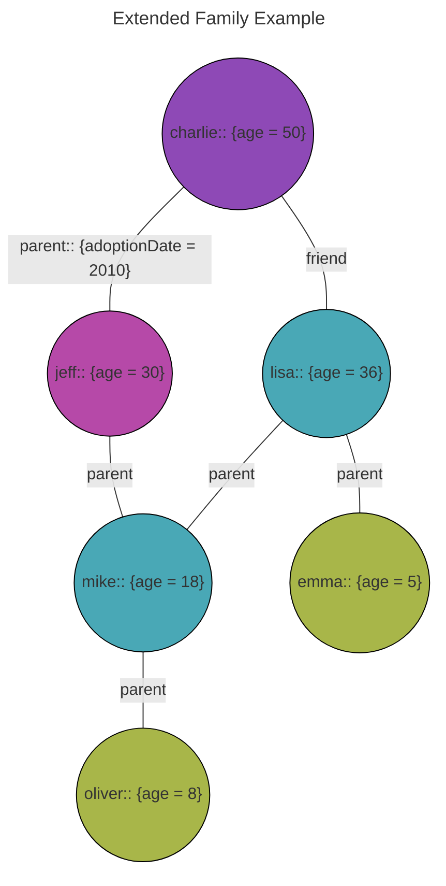
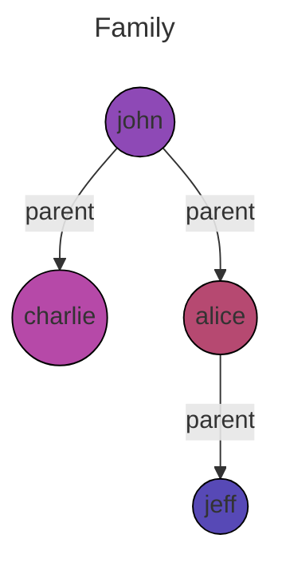
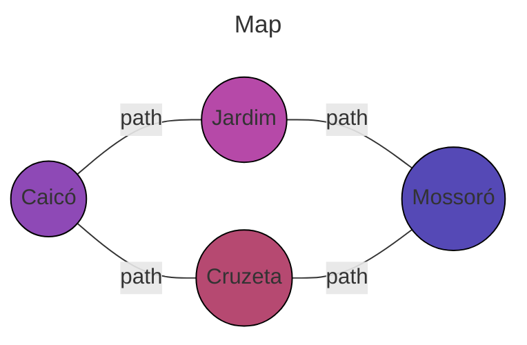

# Graphya: Proposal 3.0

Graphya is a graph language that allows you to create graphs and manipulate them. The language provides a simple syntax to create graphs and a set of built-in functions to manipulate, analyze, visualize and discover knowledge.

## Syntax

### Graph

`[<graph>];`

e.g. `[Family];`

### Node

`<node>::<graph>;`

e.g. `charlie::Family;`

### Edge

`:=: <edge>::<graph>;`

e.g. `:=: parent::Family;`

### Relations

Direction: `- | < | >`

Def: `<node>  <direction>[<edge>]<direction>  <node>;`

e.g `john  -[parent]>  charlie;`

### Attributes

#### Schema

`:<node>|<edge>: <attribute>;`

e.g. `:charlie: age;` or `:charlie: age = 40;` with default value

#### Instance

- Node instance

  `<node>: <attribute> = <value>;`

  e.g. `charlie: age = 40;`

- Edge instance

  `<node>  <direction>[<edge>:: <atribute> = <value> ]<direction>  <node>;`

  e.g. `charlie  -[parent:: adoptionDate = 2010]>  jeff;`

```sh
[Family];

charlie::Family;
jeff::Family;
lisa::Family;
emma::Family;
mike::Family;

:=: parent::Family;
:=: friend::Family;

charlie: age = 40;
jeff: age;

parent: adoptionDate;

charlie  -[parent:: adoptionDate = 2010]>  jeff;
jeff: age = 18;
```



### Functions

`<function>:<graph>:<property>?`

e.g. `is:family:tree?`

#### Arguments

`<function>:<graph>:<property>(<args>)?`

- Node is in path

  e.g. `is:in:family:path(charlie, jeff)? // true`

## Examples

1. Family

```sh
[Family];

charlie::Family;
alice::Family;
jeff::Family;
john::Family;

:=: parent::Family;

john  -[parent]>  charlie;
john  -[parent]>  alice;
alice -[parent]>  jeff;
```



2. Map

```sh
[Map];

caico::Map;
jardim::Map;
cruzeta::Map;
mossoro::Map;

:=: path::Family;

caico -[path]> jardim;
jardim -[path]> cruzeta;
cruzeta -[path]> mossoro;
mossoro -[path]> jeff;
```



## Built-in functions

- Check if a graph is complete:
  - Definition: A graph is complete if every vertex is connected to every other vertex.

    ```graphya
    is:<graph>:complete? // return: bool
    ```

    e.g. `is:family:complete? // false`

- Check if a graph is connected:
  - Definition: A graph is connected if there is a path between every pair of vertices.

    ```graphya
    is:<graph>:connected? // return: bool
    ```

    e.g. `is:family:connected? // true`

- Check if a graph is cyclic:
  - Definition: A graph is cyclic if it has at least one cycle.

    ```graphya
    is:<graph>:cyclic? // return: bool
    ```

    e.g. `is:family:cyclic? // false`

- Check if a graph is regular:
  - Definition: A graph is regular if all its vertices have the same degree.

    ```graphya
    is:<graph>:regular? // return: int
    ```

    e.g. `is:family:regular? // false`

- Check if a graph is tree:
  - Definition: A graph is a tree if it is connected and has no cycles.

    ```graphya
    is:<graph>:tree? // return: bool
    ```

    e.g. `is:family:tree? // true`

- Find the degree of a vertex:
  - Definition: The degree of a vertex is the number of edges connected to it.

    ```graphya
    degree:<vertex> // return: int
    ```

    e.g. `degree:john? // 2`

- Find the number of vertices in a graph:
  - Definition: The number of vertices in a graph is the number of nodes in the graph.

    ```graphya
    vertices:<graph> // return: int
    ```

    e.g. `vertices:family? // 4`

- Find the number of edges in a graph:
  - Definition: The number of edges in a graph is the number of relations in the graph.

    ```graphya
    edges:<graph> // return: int
    ```

    e.g. `edges:family? // 1`

- Find the most connected vertex in a graph:
  - Definition: The most connected vertex in a graph is the vertex with the largest degree.

    ```graphya
    most-connected:<graph> // return: vertex
    ```

    ```mermaid
    ---
    title: Complex Graph
    ---

    graph TB
        A((Vertex A)) ---|4| B((Vertex B))
        A ---|2| C((Vertex C))
        B ---|1| D((Vertex D))
        B ---|3| E((Vertex E))
        C ---|2| D
        C ---|3| F((Vertex F))
        D ---|4| E
        D ---|1| F
        E ---|2| G((Vertex G))
        F ---|3| G

        style A fill:#3498db,stroke:#2980b9
        style B fill:#3498db,stroke:#2980b9
        style C fill:#3498db,stroke:#2980b9
        style D fill:#3498db,stroke:#2980b9
        style E fill:#3498db,stroke:#2980b9
        style F fill:#3498db,stroke:#2980b9
        style G fill:#3498db,stroke:#2980b9
    ```

    e.g. `most-connected:ComplexGraph? // return: D`

- Find roots in a graph:
  - Definition: A root is a vertex with no incoming edges.

    ```graphya
    roots:<graph> // return: vertex[]
    ```

    e.g. `roots:family? // [john]`

- Find leaves in a graph:
  - Definition: A leaf is a vertex with no outgoing edges.

    ```graphya
    leaves:<graph> // return: vertex[]
    ```

    e.g. `leaves:family? // [jeff]`

- Find the shortest path between two vertices:
  - Definition: The shortest path between two vertices is the path that has the smallest number of edges.
  
    ```graphya
    shortest-path:<graph>:<vertex>:<vertex> // return: vertex[]
    ```

    ```mermaid
    ---
    title: RandomMap
    ---

    graph LR
      A((City A)) ---|path| B((City B))
      A ---|path| C((City C))
      B ---|path| D((City D))
      C ---|path| D
      D ---|path| E((City E))
      C ---|path| E
    ```

    e.g. `shortest-path:RandomMap:A:E:path? // return: [A, C, E]`

- Find the longest path between two vertices:
  - Definition: The longest path between two vertices is the path that has the largest number of edges.
  
    ```graphya
    longest-path:<graph>:<vertex>:<vertex> // return: vertex[]
    ```

    e.g. `longest-path:RandomMap:A:E:path? // return: [A, C, D, E]`

## Query

Call functions and get results.

```sh
~ graphya query <file-path.gripy> <function> <args>
```

e.g. `graphya query is:family:tree?`
